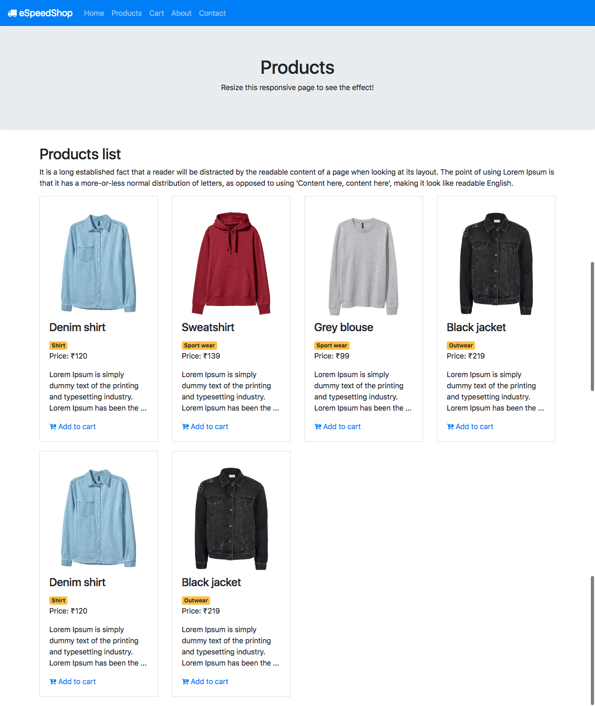
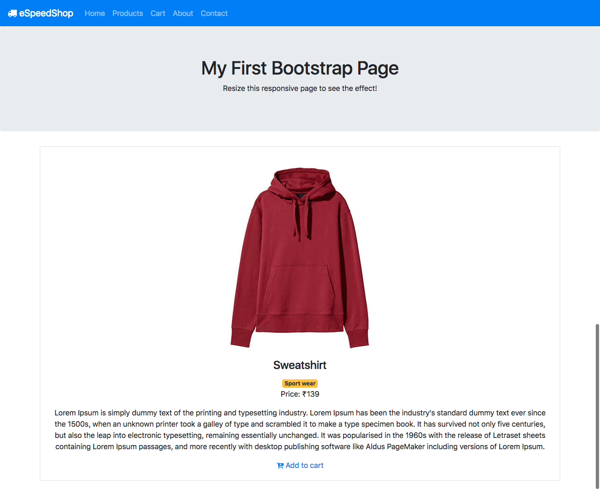
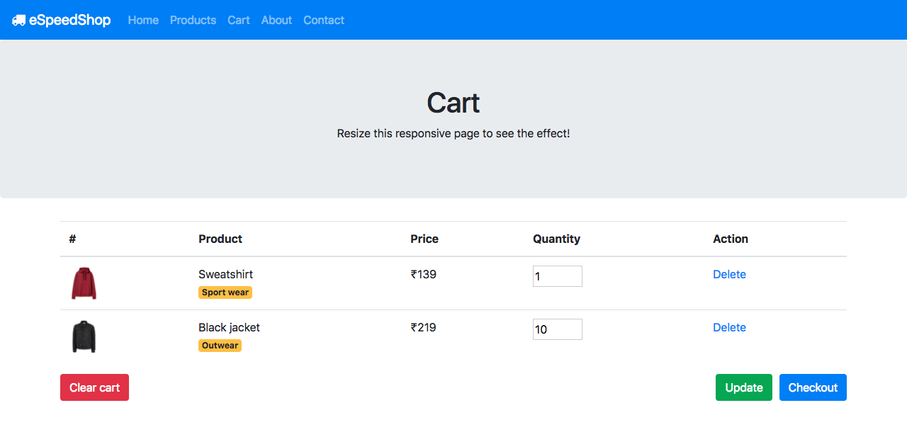
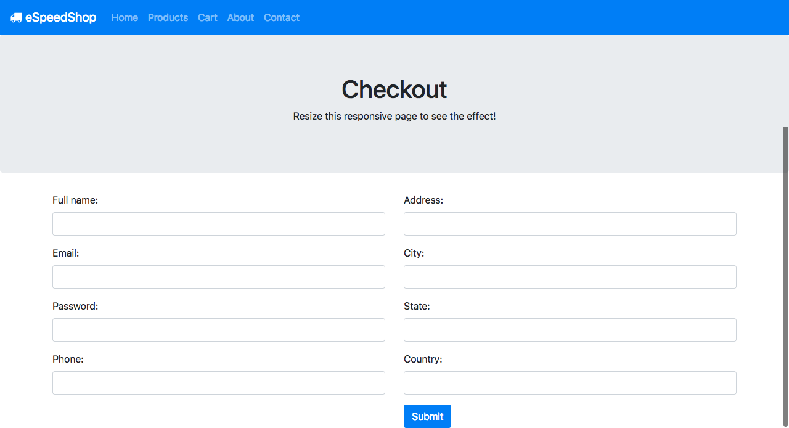

# Elastic Beanstalk with Best Practices

This repository contains:
- A sample eCommerce web application built with **Node.js**, **Express.js**, and **MySQL**.
- Infrastructure-as-Code (IaC) using **Terraform** to deploy scalable, secure AWS infrastructure (VPC, RDS, S3, Elastic Beanstalk, monitoring, and more) following industry best practices.

---

## Table of Contents

- [Features](#features)
- [Architecture](#architecture)
- [Application Overview](#application-overview)
- [Infrastructure Overview](#infrastructure-overview)
- [Getting Started](#getting-started)
- [Best Practices](#best-practices)
- [Screenshots](#screenshots)
- [License](#license)

---

## Features

### Application
- Node.js + Express.js based eCommerce site
- Product listing, cart, checkout, and product detail pages
- MySQL (SQL file included)
- Bootstrap 4 frontend

### Infrastructure (Terraform)
- AWS VPC with public/private subnets (multi-AZ)
- Internet Gateway & NAT Gateway for secure connectivity
- RDS (PostgreSQL/MySQL) in private subnets
- S3 bucket for static assets
- Elastic Beanstalk deployment for the Node.js app
- Security groups with least-privilege rules
- CloudWatch monitoring and alerting
- Modular, multi-environment support (dev, staging, prod)
- [Bonus] CI/CD pipeline support (AWS CodeBuild/Deploy, GitHub Actions, or Jenkins)

---

## Architecture

```
App Users
   |
[ Route53 / ELB ]
   |
[ Elastic Beanstalk (Node.js) ]
   |           \
   |           [ S3 (static assets) ]
   |
[ RDS (MySQL/Postgres) in private subnet ]
   |
[ VPC (public/private subnets, NAT, IGW) ]
```

---

## Application Overview

- **/index.js**: Main Express app entrypoint, configures sessions, cookies, body parsing, routes.
- **/routers/pages.js**: Route handlers for product listing, cart, checkout, etc.
- **/database/config.js**: MySQL connection setup.
- **/views/**: EJS templates for frontend pages.
- **/public/**: Static assets (CSS, JS, images).

---

## Infrastructure Overview

See [`Terraform/Root/Readme.md`](Terraform/Root/Readme.md) for full details.

Key modules:
- **VPC & Subnets**: Isolated network with public/private subnet separation.
- **Security Groups**: Restrictive, least-privilege rules for app and DB.
- **RDS**: Database in private subnet, encrypted, with backup and maintenance.
- **Elastic Beanstalk**: Managed environment for Node.js deployment.
- **S3**: Used for static file storage.
- **CloudWatch**: Monitoring, log groups, alarms.
- **Modular**: Easily supports multiple environments and DRY code.

---

## Getting Started

### Prerequisites

- Node.js, npm
- MySQL (for local dev)
- Terraform >= 1.0.0
- AWS CLI, AWS account

### Setup: Application

```sh
git clone https://github.com/AmanKumar-Gupta/Elastic-Beanstalk-with-best-practices.git
cd Elastic-Beanstalk-with-best-practices
npm install
# configure MySQL connection in database/config.js
npm start
```

### Setup: Infrastructure

See [`Terraform/Root/Readme.md`](Terraform/Root/Readme.md) for detailed instructions.

```sh
cd Terraform/Root
terraform init
terraform plan
terraform apply
```

- Configure environment variables and secrets as appropriate for production (e.g., via AWS Secrets Manager).

---

## Best Practices

- Modular Terraform for reusability and clarity
- Resource tagging, parameterized configuration
- Multi-AZ deployment for high availability
- Secure private subnets for databases
- KMS encryption (DB, S3)
- CloudWatch monitoring and log management
- CI/CD pipeline support (see assignment/bonus)

---

## Screenshots

Products list page  


Product details page  


Cart page  


Checkout page  


---

## License

[MIT](LICENSE) (or specify your license here)

---

## References

- See `Assignment.md` for the project requirements and deliverables.
- See [`Terraform/Root/Readme.md`](Terraform/Root/Readme.md) for infra details.

---

> **Note:**  
> This README was generated based on the latest code and infrastructure in this repository. For more details, browse the code or see the [GitHub code search](https://github.com/AmanKumar-Gupta/Elastic-Beanstalk-with-best-practices/search).
# Screenshots

Products list page


Product details page


Cart page


Checkout page


